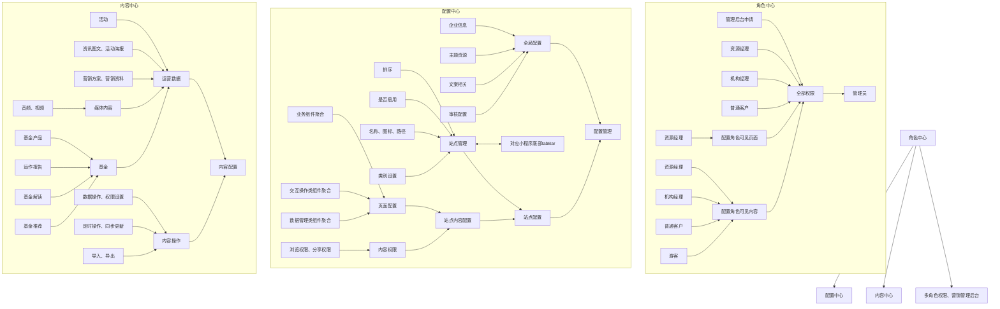
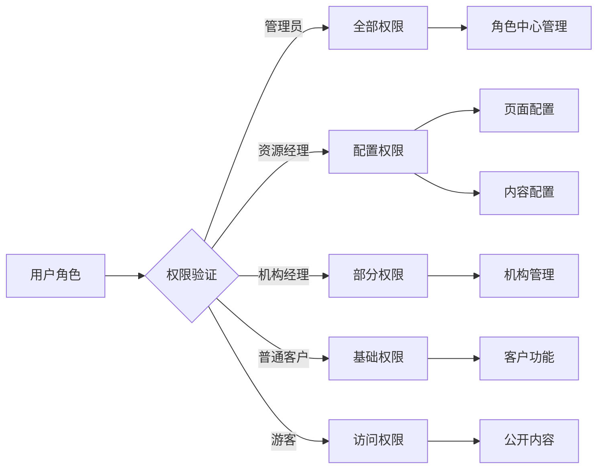
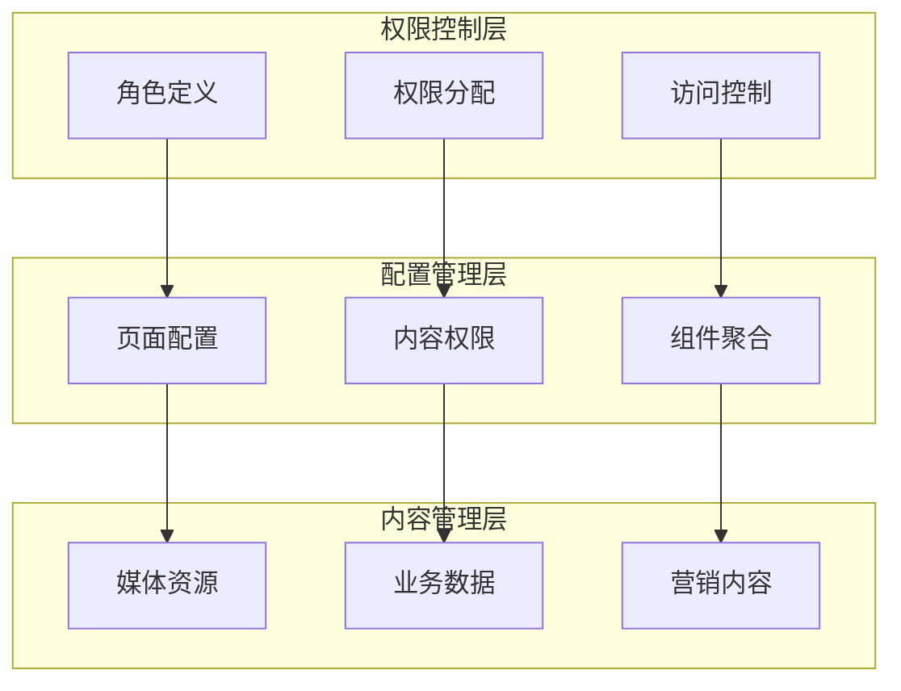

# 多角色权限管理系统架构图

## 系统整体架构

```mermaid
graph TD
    A[角色中心] --> B[配置中心]
    A --> C[内容中心]
    A --> D[多角色权限、营销管理后台]
    
    subgraph "角色中心"
        A1[管理后台申请] --> A2[全部权限]
        A2 --> A3[管理员]
        
        A4[资源经理] --> A2
        A5[机构经理] --> A2
        A6[普通客户] --> A2
        
        A7[资源经理] --> A8[配置角色可见页面]
        A8 --> A2
        
        A9[资源经理] --> A10[配置角色可见内容]
        A10 --> A2
        
        A11[机构经理] --> A10
        A12[普通客户] --> A10
        A13[游客] --> A10
    end
    
    subgraph "配置中心"
        B1[业务组件聚合]
        B2[交互操作类组件聚合]
        B3[数据管理类组件聚合]
        B1 --> B4[页面配置]
        B2 --> B4
        B3 --> B4

        B5[浏览权限、分享权限] --> B6[内容权限]
        B4 --> B7[站点内容配置]
        B6 --> B7

        B8[排序] --> B13[站点管理]
        B9[是否启用] --> B13
        B10[名称、图标、路径] --> B13
        B11[类别设置] --> B13
        B13 --> B14[站点配置]
        B7 --> B14
        B13 <--> B21[对应小程序底部tabBar]

        B15[企业信息] --> B19[全局配置]
        B16[主题资源] --> B19
        B17[文案相关] --> B19
        B18[审核配置] --> B19

        B19 --> B20[配置管理]
        B14 --> B20
    end
    
    subgraph "内容中心"
        C1[音频、视频]
        C3[活动]
        C4[资讯图文、活动海报]
        C6[营销方案、营销资料]
        C7[基金产品]
        C9[基金解读]
        C8[运作报告]
        C10[基金推荐]
        C13[数据操作、权限设置]
        C16[定时操作、同步更新]
        C17[导入、导出]
        C1 --> C14[媒体内容]
        C7 --> C15[基金]
        C8 --> C15
        C9 --> C15
        C10 --> C15
        C3 --> C5[运营数据]
        C4 --> C5
        C6 --> C5
        C14 --> C5
        C15 --> C5
        C13 --> C11[内容操作]
        C16 --> C11
        C17 --> C11
        C5 --> C12[内容配置]
        C11 --> C12
    end
```

## 权限管理流程

```mermaid
flowchart LR
    A[用户角色] --> B{权限验证}
    B -->|管理员| C[全部权限]
    B -->|资源经理| D[配置权限]
    B -->|机构经理| E[部分权限]
    B -->|普通客户| F[基础权限]
    B -->|游客| G[访问权限]
    
    C --> H[角色中心管理]
    D --> I[页面配置]
    D --> J[内容配置]
    E --> K[机构管理]
    F --> L[客户功能]
    G --> M[公开内容]
```

## 核心模块关系

```mermaid
graph TB
    subgraph "权限控制层"
        A1[角色定义]
        A2[权限分配]
        A3[访问控制]
    end
    
    subgraph "配置管理层"
        B1[页面配置]
        B2[内容权限]
        B3[组件聚合]
    end
    
    subgraph "内容管理层"
        C1[媒体资源]
        C2[业务数据]
        C3[营销内容]
    end
    
    A1 --> B1
    A2 --> B2
    A3 --> B3
    B1 --> C1
    B2 --> C2
    B3 --> C3
```