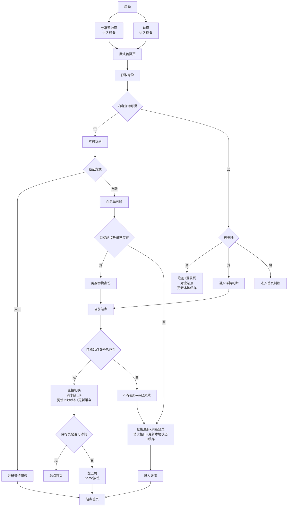
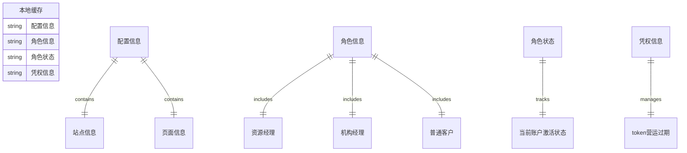
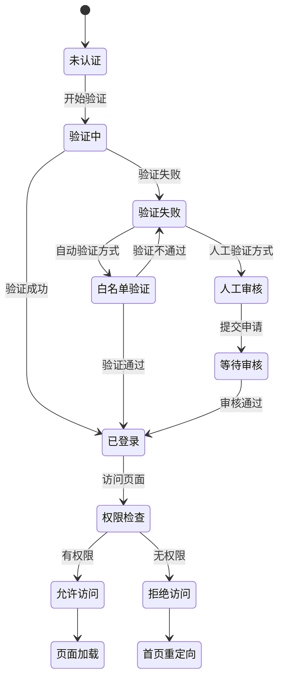
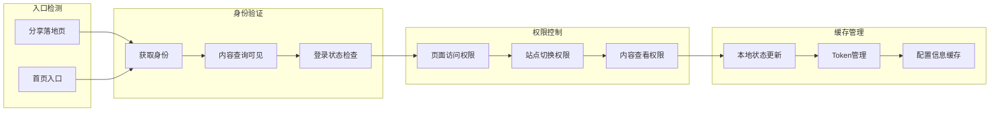

# 用户认证与页面访问控制流程

## 主流程图

```mermaid
flowchart TD
    A[启动] --> B[分享落地页<br/>进入设备]
    A --> C[首页<br/>进入设备]
    
    B --> D[默认首页页]
    C --> D
    
    D --> E[获取身份]
    
    E --> F{内容查询可见}
    F -->|否| G[不可访问]
    F -->|是| H{已登陆}
    
    G --> I{验证方式}
    I -->|人工| J[注册等待审核]
    I -->|自动| K[白名单校验]
    
    H -->|否| L[注册+登录页<br/>对应站点<br/>更新本地缓存]
    H -->|是| M[进入详情判断]
    H -->|是| N[进入首页判断]
    
    K --> O{目标站点身份已存在}
    O -->|是| P[需要切换身份]
    O -->|否| Q[登录注册+刷新登录<br/>请求接口+更新本地状态<br/>+缓存]
    
    P --> R[当前站点]
    M --> R
    
    R --> S{目标站点身份已存在}
    S -->|是| T[直接切换<br/>请求接口+<br/>更新本地状态+更新缓存]
    S -->|否| U[不存在token已失效]
    
    U --> Q
    T --> V{目标页是否可访问}
    Q --> W[进入详情]
    
    V -->|是| X[站点首页]
    V -->|否| Y[左上角<br/>home按钮]
    
    W --> Z[站点首页]
    Y --> Z
    J --> Z
```

## 数据存储结构

```mermaid
erDiagram
    本地缓存 {
        string 配置信息
        string 角色信息  
        string 角色状态
        string 凭权信息
    }
    
    配置信息 ||--|| 站点信息 : contains
    配置信息 ||--|| 页面信息 : contains
    
    角色信息 ||--|| 资源经理 : includes
    角色信息 ||--|| 机构经理 : includes  
    角色信息 ||--|| 普通客户 : includes
    
    角色状态 ||--|| 当前账户激活状态 : tracks
    
    凭权信息 ||--|| token营运过期 : manages
```

## 认证状态管理

```mermaid
stateDiagram-v2
    [*] --> 未认证
    未认证 --> 验证中 : 开始验证
    验证中 --> 已登录 : 验证成功
    验证中 --> 验证失败 : 验证失败
    验证失败 --> 人工审核 : 人工验证方式
    验证失败 --> 白名单验证 : 自动验证方式
    人工审核 --> 等待审核 : 提交申请
    白名单验证 --> 已登录 : 验证通过
    白名单验证 --> 验证失败 : 验证不通过
    已登录 --> 权限检查 : 访问页面
    权限检查 --> 允许访问 : 有权限
    权限检查 --> 拒绝访问 : 无权限
    允许访问 --> 页面加载
    拒绝访问 --> 首页重定向
    等待审核 --> 已登录 : 审核通过
```

## 核心业务逻辑

```mermaid
graph LR
    subgraph "入口检测"
        A1[分享落地页] 
        A2[首页入口]
    end
    
    subgraph "身份验证"
        B1[获取身份]
        B2[内容查询可见]
        B3[登录状态检查]
    end
    
    subgraph "权限控制"
        C1[页面访问权限]
        C2[站点切换权限]
        C3[内容查看权限]
    end
    
    subgraph "缓存管理"
        D1[本地状态更新]
        D2[Token管理]
        D3[配置信息缓存]
    end
    
    A1 --> B1
    A2 --> B1
    B1 --> B2
    B2 --> B3
    B3 --> C1
    C1 --> C2
    C2 --> C3
    C3 --> D1
    D1 --> D2
    D2 --> D3
```