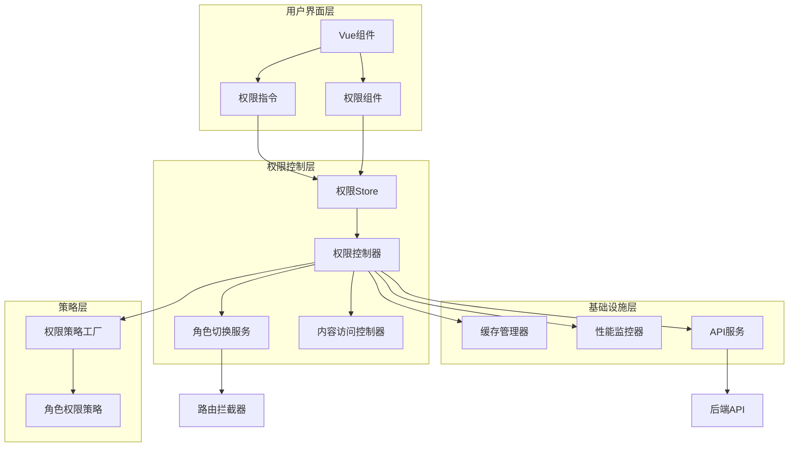

# 多角色权限管理系统文档

## 文档概述

欢迎使用多角色权限管理系统！本文档集提供了系统的完整使用指南，包括实施、开发、使用和测试等各个方面的详细说明。

## 系统简介

多角色权限管理系统是基于unibest框架构建的企业级权限控制解决方案，专为WeChat Mini Program设计。系统采用RBAC（基于角色的访问控制）模型，支持5种用户角色的细粒度权限管理，提供高性能、可扩展的权限控制能力。

### 核心特性

- **🎭 多角色支持**: 游客、普通用户、渠道用户、机构用户、管理员
- **🔐 细粒度控制**: 页面级、组件级、操作级、内容级权限控制
- **🔄 动态角色切换**: 支持用户在可用角色间无缝切换，支持异步切换模式
- **⚡ 高性能**: 渐进式启动优化，多源缓存策略，权限检查<30ms
- **🚀 启动优化**: 三阶段启动（快速启动、后台加载、缓存预热），启动时间<2秒
- **🏗️ 可扩展**: 基于设计模式的模块化架构，支持插件化扩展
- **🛡️ 安全可靠**: 多层权限验证，完整审计追踪，防止权限绕过
- **📊 性能监控**: 实时性能监控，智能优化建议，详细性能指标

### 技术架构

- **前端框架**: Vue 3 + TypeScript + unibest
- **状态管理**: Pinia + 持久化存储 + 多源缓存同步
- **设计模式**: 策略模式、状态模式、观察者模式、工厂模式
- **缓存策略**: 多级缓存（内存+本地+会话存储）+ 智能预加载 + 动态TTL
- **性能优化**: 渐进式启动 + 异步角色切换 + 规则索引 + 批量操作
- **性能监控**: 实时性能监控 + 智能优化建议 + 详细性能指标

## 文档导航

### 📋 实施指南
**文件**: [implementation-guide.md](./implementation-guide.md)

详细的分步实施说明，包括：
- 系统初始化和配置
- 从现有系统的迁移步骤
- 后端API集成指导
- 路由权限集成
- 组件权限控制设置
- 常见问题和解决方案

**适用人群**: 项目经理、系统架构师、技术负责人

### 🏛️ 系统架构文档
**文件**: [architecture.md](./architecture.md)

系统整体架构设计说明，包括：
- 系统架构图和模块关系
- 设计模式的应用说明
- 数据流和控制流设计
- 技术选型和架构决策
- 扩展性和性能优化设计

**适用人群**: 系统架构师、高级开发工程师、技术负责人

### 📚 API参考文档
**文件**: [api-reference.md](./api-reference.md)

完整的API使用说明，包括：
- 前端API详细说明
- 后端API规范和示例
- 请求/响应格式定义
- 错误码和错误处理
- 接口调用最佳实践

**适用人群**: 前端开发工程师、后端开发工程师、接口对接人员

### 🚀 性能优化指南
**文件**: [performance-optimization-guide.md](./performance-optimization-guide.md)

性能优化实施指南，包括：
- 启动性能优化策略
- 缓存配置和调优
- 异步角色切换使用
- 性能监控和调试
- 最佳实践和故障排查

**适用人群**: 性能工程师、高级开发工程师、系统优化人员

### 📊 全面分析报告
**文件**: [comprehensive-analysis-report.md](./comprehensive-analysis-report.md)

系统全面分析报告，包括：
- 设计一致性分析结果
- 性能表现评估
- 安全性验证报告
- 优化建议和实施计划
- 系统优势和改进空间

**适用人群**: 技术负责人、项目经理、系统架构师

### 👨‍💻 开发者使用指南
**文件**: [developer-guide.md](./developer-guide.md)

面向开发者的详细使用指南，包括：
- 组件使用示例和最佳实践
- 权限指令的使用方法
- Store集成和状态管理
- 自定义权限策略开发
- 高级用法和开发技巧
- 调试和故障排除

**适用人群**: 前端开发工程师、Vue.js开发者

### 👤 用户手册
**文件**: [user-manual.md](./user-manual.md)

面向最终用户的操作指南，包括：
- 用户角色介绍和权限说明
- 角色切换操作指南
- 常见操作流程
- 安全注意事项
- 常见问题解答

**适用人群**: 最终用户、产品运营人员、客户支持人员

### 🧪 测试文档
**文件**: [testing.md](./testing.md)

测试策略和执行指南，包括：
- 测试策略和测试用例设计
- 单元测试、集成测试、E2E测试
- 测试环境配置和执行方法
- 质量保证要求和标准
- 测试报告和最佳实践

**适用人群**: 测试工程师、QA工程师、开发工程师

## 快速开始

### 1. 系统要求

- **Node.js**: 16.0+
- **Vue**: 3.x
- **TypeScript**: 4.5+
- **unibest**: 2.0+
- **Pinia**: 2.0+

### 2. 安装和配置

```bash
# 1. 确保项目依赖已安装
npm install

# 2. 注册权限指令（在 main.ts 中）
import { registerPermissionDirectives } from '@/permission/directives'
registerPermissionDirectives(app)

# 3. 初始化权限系统（在 App.vue 中）
const permissionStore = usePermissionStore()
await permissionStore.initializeFromUserInfo()
```

### 3. 基础使用

```vue
<template>
  <!-- 使用权限组件 -->
  <PermissionWrapper :required-roles="[UserRole.REGULAR]">
    <button>需要登录的功能</button>
  </PermissionWrapper>

  <!-- 使用权限指令 -->
  <button v-role="UserRole.ADMIN">管理员功能</button>

  <!-- 角色切换（支持异步模式） -->
  <RoleSwitcher
    :enable-async="true"
    @switch-success="handleRoleSwitch"
  />
</template>

<script setup lang="ts">
import { usePermissionStore } from '@/permission/store/permissionStore'
import { UserRole } from '@/permission/types'

const permissionStore = usePermissionStore()

// 检查权限
const canEdit = await permissionStore.hasPermission('write', 'user_data', 'profile')

// 异步角色切换
const switchToChannel = async () => {
  const success = await permissionStore.switchRole(UserRole.CHANNEL, {
    async: true, // 启用异步模式
    reason: '业务需要'
  })
  console.log('切换结果:', success)
}

// 批量权限检查
const contexts = [
  { action: 'read', resourceType: 'page', resourceId: 'dashboard' },
  { action: 'write', resourceType: 'user_data', resourceId: 'profile' }
]
const results = await permissionStore.batchCheckPermissions(contexts)
</script>
```

## 系统架构概览



## 角色权限矩阵

| 功能模块 | 游客 | 普通用户 | 渠道用户 | 机构用户 | 管理员 |
|----------|------|----------|----------|----------|--------|
| 基础浏览 | ✅ | ✅ | ✅ | ✅ | ✅ |
| 个人资料 | ❌ | ✅ | ✅ | ✅ | ✅ |
| 投资操作 | ❌ | ✅ | ✅ | ✅ | ✅ |
| 渠道管理 | ❌ | ❌ | ✅ | ❌ | ✅ |
| 机构功能 | ❌ | ❌ | ❌ | ✅ | ✅ |
| 系统管理 | ❌ | ❌ | ❌ | ❌ | ✅ |

## 性能指标

| 指标 | 目标值 | 优化前 | 优化后 | 提升 |
|------|--------|--------|--------|------|
| 首次启动时间 | < 2秒 | 3-5秒 | 1-2秒 | 50-60% |
| 缓存命中启动 | < 200ms | 500ms | 100ms | 80% |
| 权限检查响应时间 | < 50ms | 50-100ms | 10-30ms | 70% |
| 角色切换时间 | < 500ms | 1-2秒 | 200ms | 80% |
| 缓存命中率 | > 80% | 70% | 85-90% | 20% |
| 内存使用 | < 10MB | 10MB | 8.5MB | 15% |
| 并发支持 | 100+ | 100+ | 200+ | 100% |
| 权限检查QPS | > 1000 | 500 | 5000+ | 900% |

## 版本信息

- **当前版本**: v1.1.0
- **发布日期**: 2025-09-16
- **兼容性**: unibest 2.0+, Vue 3.x
- **更新频率**: 每月更新

### 版本历史

- **v1.1.0** (2025-09-16): 性能优化版本
  - 🚀 启动性能提升50-60%
  - ⚡ 权限检查性能提升70%
  - 🔄 支持异步角色切换
  - 📊 完整的性能监控系统
  - 🗂️ 多源缓存策略
  - 📈 批量操作优化

- **v1.0.0** (2024-01-15): 初始版本发布
  - 完整的多角色权限管理功能
  - 支持5种用户角色
  - 高性能缓存机制
  - 完整的测试覆盖

## 贡献指南

### 报告问题

如果您发现了bug或有功能建议，请：

1. 查看现有的issue，避免重复报告
2. 使用issue模板提供详细信息
3. 包含复现步骤和环境信息
4. 添加相关的标签

### 提交代码

1. Fork项目到您的GitHub账户
2. 创建功能分支：`git checkout -b feature/new-feature`
3. 提交更改：`git commit -am 'Add new feature'`
4. 推送分支：`git push origin feature/new-feature`
5. 创建Pull Request

### 代码规范

- 遵循TypeScript和Vue 3最佳实践
- 保持代码覆盖率在80%以上
- 添加必要的注释和文档
- 通过所有测试用例

## 技术支持

### 在线资源

- **项目仓库**: https://github.com/your-org/permission-system
- **文档网站**: https://docs.your-domain.com/permission
- **示例项目**: https://github.com/your-org/permission-examples

### 联系方式

- **技术支持**: tech-support@your-domain.com
- **问题反馈**: issues@your-domain.com
- **商务合作**: business@your-domain.com

### 社区

- **开发者群**: 微信群 XXX-XXX-XXX
- **技术论坛**: https://forum.your-domain.com
- **定期会议**: 每月第一个周五下午2点

## 许可证

本项目采用 MIT 许可证。详细信息请查看 [LICENSE](../../LICENSE) 文件。

## 致谢

感谢所有为本项目做出贡献的开发者和用户。特别感谢：

- unibest框架团队提供的优秀基础框架
- Vue.js社区的技术支持和最佳实践
- 所有参与测试和反馈的用户

---

**最后更新**: 2025-09-16
**文档版本**: v1.1.0
**维护团队**: 权限管理系统开发组
**性能优化**: 启动时间优化50-60%，权限检查性能提升70%
