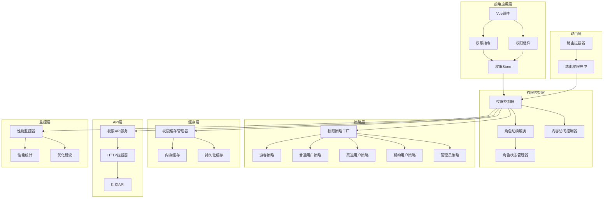
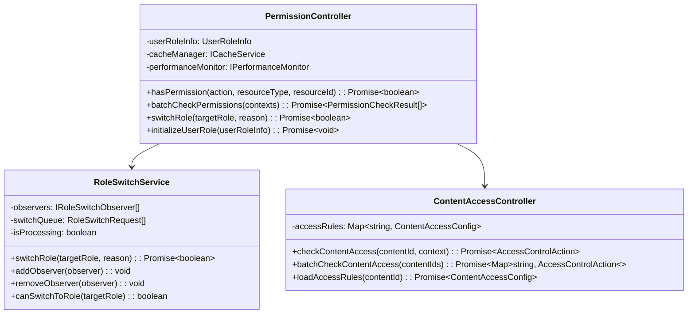
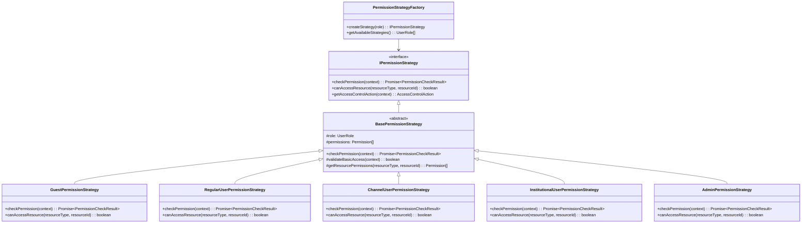
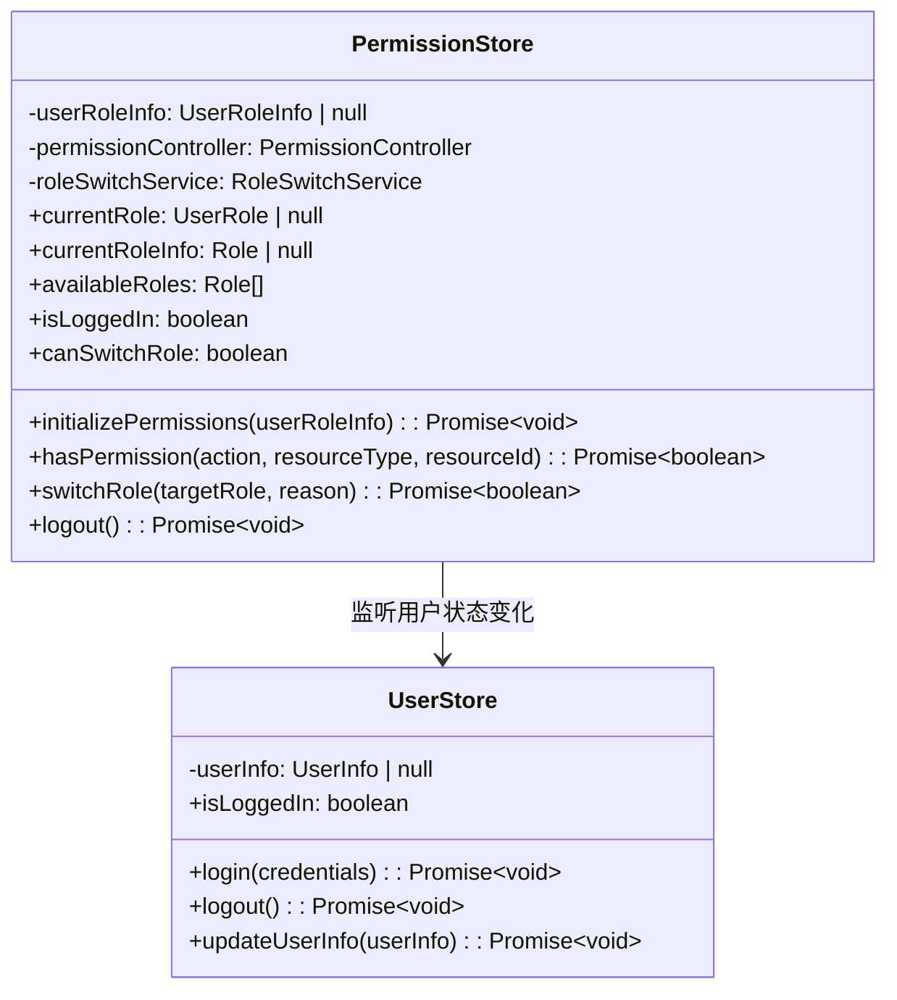
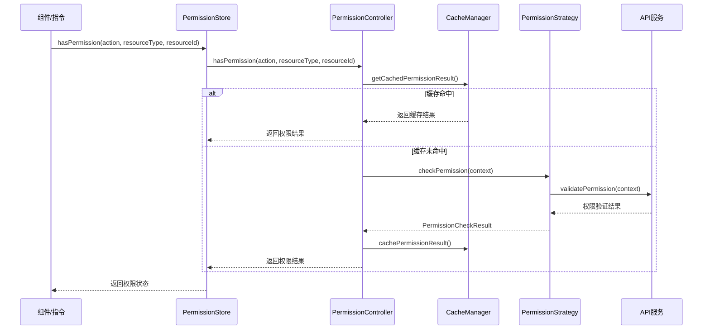
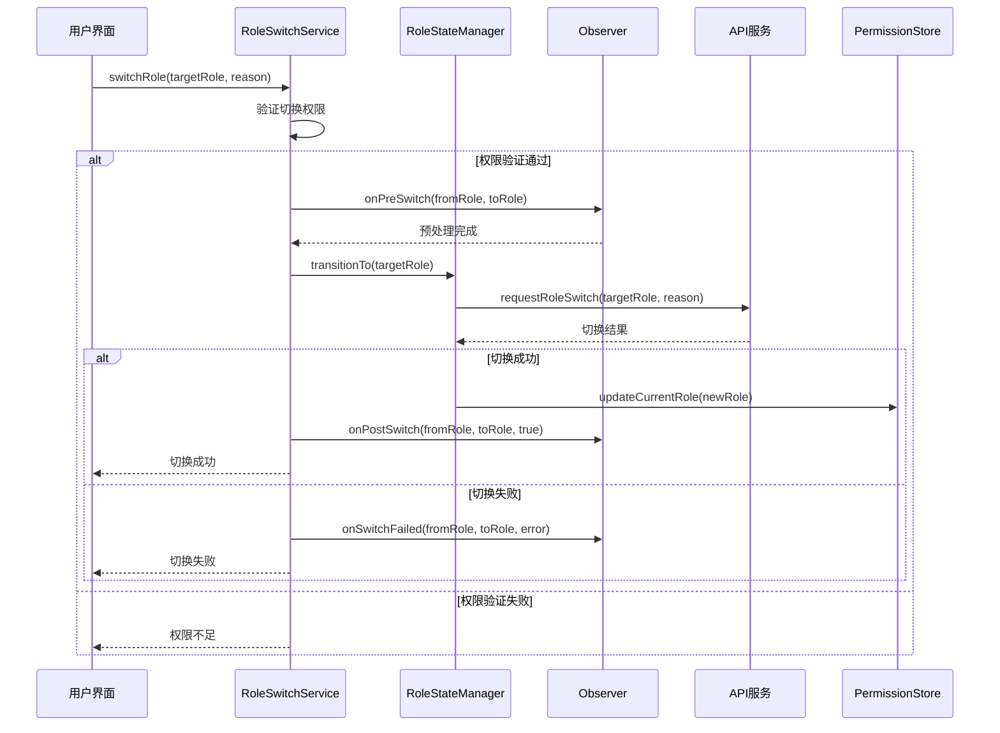
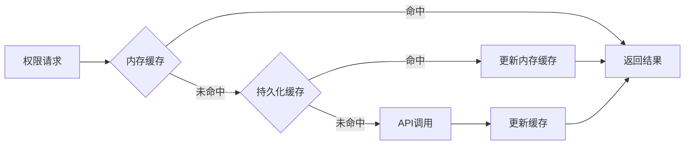

# 多角色权限管理系统架构文档

## 系统概述

多角色权限管理系统是基于unibest框架构建的企业级权限控制解决方案，采用RBAC（基于角色的访问控制）模型，支持5种用户角色的细粒度权限管理。

### 核心特性
- **多角色支持**: 游客、普通用户、渠道用户、机构用户、管理员
- **细粒度控制**: 页面级、组件级、操作级、内容级权限控制
- **动态角色切换**: 支持用户在可用角色间无缝切换
- **高性能**: 多级缓存策略，权限检查<50ms
- **可扩展**: 基于设计模式的模块化架构

## 整体架构图



## 核心模块架构

### 1. 权限控制核心 (Core)



### 2. 策略模式架构



### 3. 状态管理架构



## 数据流架构

### 1. 权限检查流程



### 2. 角色切换流程



## 设计模式应用

### 1. 策略模式 (Strategy Pattern)
**应用场景**: 不同角色的权限检查逻辑
**实现位置**: `src/permission/strategies/`
**优势**: 
- 算法族独立变化
- 避免大量条件判断
- 易于扩展新角色

```typescript
// 策略接口
interface IPermissionStrategy {
  checkPermission(context: PermissionContext): Promise<PermissionCheckResult>
}

// 具体策略
class RegularUserPermissionStrategy implements IPermissionStrategy {
  async checkPermission(context: PermissionContext): Promise<PermissionCheckResult> {
    // 普通用户权限检查逻辑
  }
}
```

### 2. 状态模式 (State Pattern)
**应用场景**: 角色状态管理和转换
**实现位置**: `src/permission/core/RoleStateManager.ts`
**优势**:
- 状态转换逻辑清晰
- 易于添加新状态
- 状态相关行为封装

```typescript
// 状态接口
interface IRoleState {
  enter(context: RoleStateContext): Promise<void>
  exit(context: RoleStateContext): Promise<void>
  canTransitionTo(targetRole: UserRole): boolean
}

// 具体状态
class RegularUserState implements IRoleState {
  async enter(context: RoleStateContext): Promise<void> {
    // 进入普通用户状态的逻辑
  }
}
```

### 3. 观察者模式 (Observer Pattern)
**应用场景**: 角色切换事件通知
**实现位置**: `src/permission/core/RoleSwitchService.ts`
**优势**:
- 松耦合的事件通知
- 支持多个观察者
- 易于扩展事件处理

```typescript
// 观察者接口
interface IRoleSwitchObserver {
  onPreSwitch(fromRole: UserRole, toRole: UserRole): Promise<boolean>
  onPostSwitch(fromRole: UserRole, toRole: UserRole, success: boolean): Promise<void>
}
```

### 4. 工厂模式 (Factory Pattern)
**应用场景**: 权限策略创建
**实现位置**: `src/permission/strategies/index.ts`
**优势**:
- 对象创建逻辑集中
- 易于管理对象生命周期
- 支持依赖注入

```typescript
class PermissionStrategyFactory {
  createStrategy(role: UserRole): IPermissionStrategy {
    switch (role) {
      case UserRole.REGULAR:
        return new RegularUserPermissionStrategy()
      case UserRole.CHANNEL:
        return new ChannelUserPermissionStrategy()
      // ...
    }
  }
}
```

### 5. 装饰器模式 (Decorator Pattern)
**应用场景**: 性能监控和缓存
**实现位置**: `src/permission/performance/PermissionPerformanceMonitor.ts`
**优势**:
- 功能增强不修改原有代码
- 支持多层装饰
- 职责单一

```typescript
@monitorPerformance('permission_check')
async function checkPermission(context: PermissionContext): Promise<PermissionCheckResult> {
  // 权限检查逻辑
}
```

## 技术选型和架构决策

### 1. 状态管理选择: Pinia
**选择原因**:
- Vue 3官方推荐
- TypeScript支持优秀
- 模块化设计
- 支持插件扩展

**架构优势**:
- 响应式状态管理
- 自动持久化
- 开发工具支持

### 2. 缓存策略: 多级缓存
**设计决策**:
- 内存缓存: 快速访问，容量有限
- 持久化缓存: 跨会话保持，容量较大
- LRU淘汰策略: 保证缓存效率

**性能优势**:
- 权限检查响应时间<50ms
- 减少API调用次数
- 提升用户体验

### 3. 模块化设计
**架构原则**:
- 单一职责原则
- 开闭原则
- 依赖倒置原则

**模块划分**:
```
permission/
├── types/          # 类型定义
├── interfaces/     # 接口定义
├── core/          # 核心业务逻辑
├── strategies/    # 权限策略
├── store/         # 状态管理
├── components/    # UI组件
├── directives/    # Vue指令
├── api/           # API服务
├── cache/         # 缓存管理
└── performance/   # 性能监控
```

## 扩展性设计

### 1. 新角色扩展
添加新角色只需要：
1. 在 `UserRole` 枚举中添加新角色
2. 实现对应的权限策略类
3. 在工厂类中注册新策略
4. 更新角色配置

### 2. 新权限类型扩展
添加新权限类型：
1. 在 `PermissionAction` 枚举中添加
2. 在相关策略中实现检查逻辑
3. 更新API接口

### 3. 新访问控制动作扩展
添加新的访问控制动作：
1. 在 `AccessControlAction` 枚举中添加
2. 在组件中实现对应的UI处理
3. 更新文档说明

## 性能优化架构

### 1. 缓存架构


### 2. 性能监控架构
- **实时监控**: 权限检查耗时统计
- **性能报告**: 定期生成性能分析报告
- **优化建议**: 基于监控数据提供优化建议
- **告警机制**: 性能异常自动告警

### 3. 批量处理架构
- **批量权限检查**: 减少API调用次数
- **预加载策略**: 提前加载可能需要的权限
- **异步处理**: 非阻塞的权限验证

## 安全性架构

### 1. 权限验证层次
1. **前端验证**: UI层面的权限控制
2. **路由验证**: 页面访问权限控制
3. **API验证**: 接口级权限验证
4. **后端验证**: 服务端最终权限确认

### 2. 安全策略
- **最小权限原则**: 用户只获得必需的权限
- **权限继承**: 高级角色继承低级角色权限
- **权限审计**: 记录所有权限操作
- **会话管理**: 权限状态与用户会话绑定

## 监控和运维

### 1. 性能监控指标
- 权限检查响应时间
- 缓存命中率
- API调用频率
- 错误率统计

### 2. 业务监控指标
- 角色切换频率
- 权限拒绝次数
- 用户行为分析
- 系统使用统计

### 3. 运维支持
- 配置热更新
- 权限规则动态调整
- 性能调优建议
- 故障自动恢复

这个架构设计确保了系统的高性能、可扩展性和可维护性，为WeChat Mini Program提供了企业级的权限管理能力。
